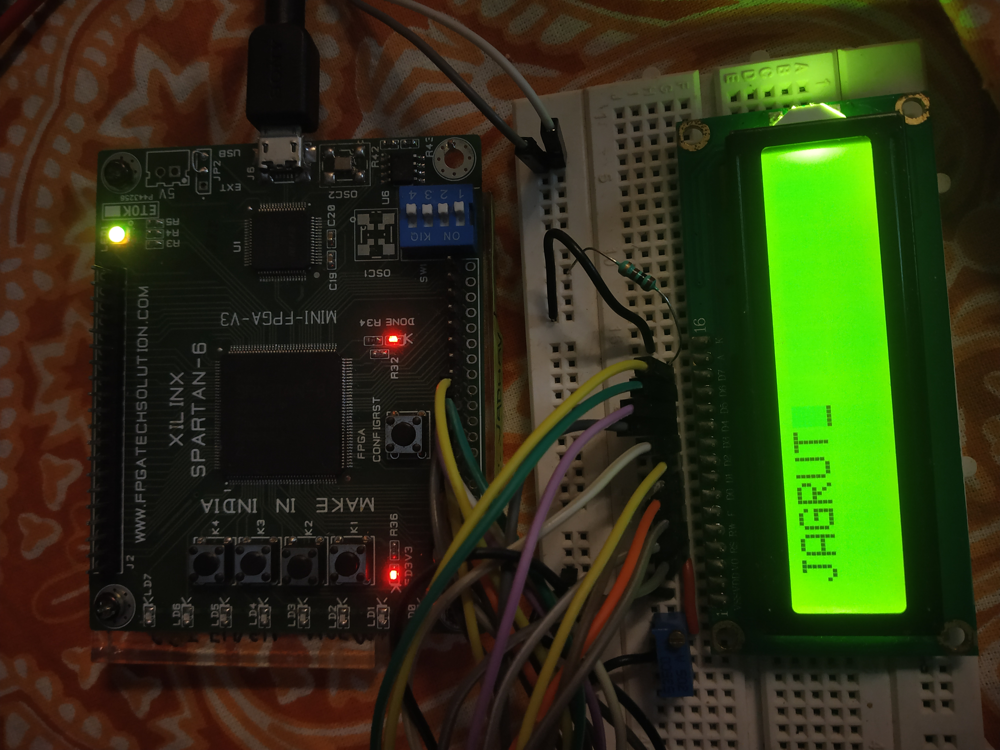

# FPGA_Spartan6_Programs
FPGA programs used for practice on Xilinx spartan 6 board.

16x2 LCD uses UART interface to transmit data from computer. The module used 4 push buttons to send the command and data to the LCD module. The 8bit command/data is fed inside the FPGA using UART interface first and then transmitted to LCD ueing a pushbutton.

